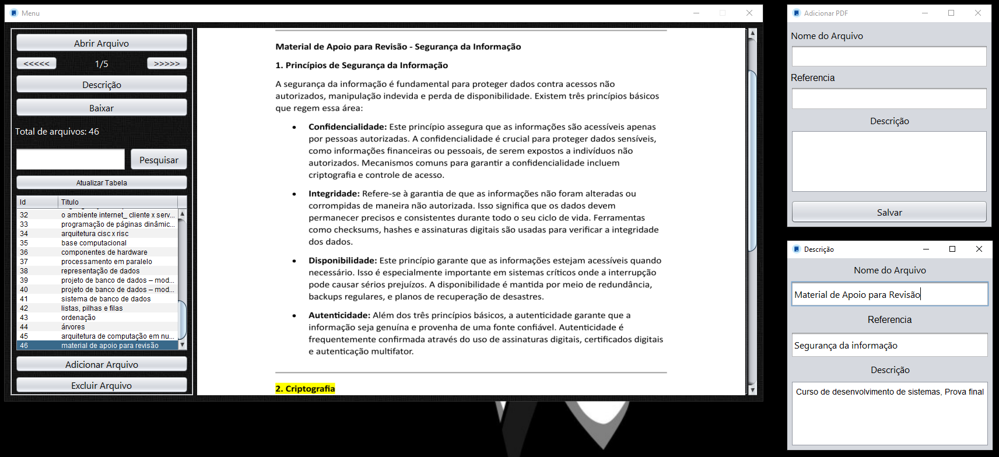

# Organizador-Apostila

Este é um programa simples que facilita a organização de arquivos PDF.
O objetivo principal foi criar uma ferramenta que permita manter os documentos de estudo bem organizados, tornando mais fácil encontrar e acessar o material necessário.

## Bibliotecas Utilizadas
logback: Ferramenta de registro (logging) em Java, utilizada para gerar logs de maneira flexível e eficiente.

slf4j: (Simple Logging Facade for Java) é uma API de abstração de logging para a linguagem Java, permitindo que você utilize diferentes frameworks de logging de forma intercambiável.

sqlite-jdbc: Driver JDBC (Java Database Connectivity) que permite que aplicativos Java se conectem a bancos de dados SQLite.

apache PDFBox: Biblioteca Java que permite a manipulação de arquivos PDF, incluindo a criação, edição, extração de conteúdo e assinatura digital de documentos PDF.

## Banco de Dados Utilizado: SQLite
SQLite é um sistema de gerenciamento de banco de dados relacional leve e autossuficiente, amplamente usado por ser embutido e não requerer a instalação de um servidor de banco de dados.
